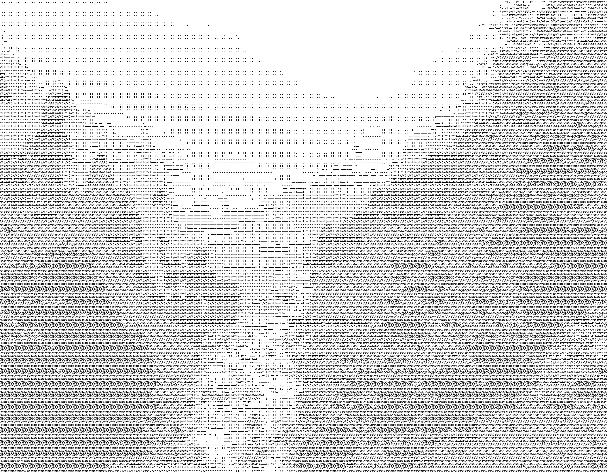

# [PYTHON] ASCII generator

## Introduction

As you can tell by its name, this little software is a set of scripts which allow you to convert media to ASCII art.\
Please note that this repository is a fork from another one made by [uvipen](https://github.com/uvipen), which you can find [here](https://github.com/uvipen/ASCII-generator). This means I didn't write the original code, I only modified it and added some.

With that out of the way, here is the list of what you can do:
- Convert an image to text
- Convert text to an image
- Convert an image to an ASCII art version
- Convert a video to an ASCII art version

## Video to video

*Note: this script has not been modified from the original*

Converts a video file to an ASCII art verion.\
Usage: `video2video.py --input <input_path> --output <output_path> --mode <simple/complex> --background <black/white> --num_cols <int> --scale <int> --fps <int> --overlay_ratio <float>`

For a complete demo of the results you can get, please follow [this link](https://github.com/uvipen/ASCII-generator/blob/master/README.md)

## Image to text

Converts an image to text.\
Usage: `img2txt.py -i <input_path> -o <output_path> --res <float> --charset <str>`

- *res*: the amount of characters used by surface unit. The default is 2. Increasing this value will allow to represent more details from the original image.
- *charset*: the set of characters to use, in a string. Default is `'@%#*+=-:. '`

## Text to image

Renders text to an image.\
Usage: `txt2img.py -i <input_path> -o <output_path> --bg <white/black/transparent> --scale <float>`

- *bg*: the background color of the output image.
- *scale*: the scale of the font/output image. Default is 2.5.

Note that the aspect ratio of the result may not be exactly the same as for the original, which can be fixed easily with any image editor. 

## Image to image

This script (`img2img.py`) does exactly what the two previous ones do, to combine the process into a single step. It uses the exact same arguments as seen above.

## Demo

This is the kind of result you can get with this tool:

    <i>Input</i> 
    

    <i>Output</i> 
    

    <i>Input</i> 
    

    <i>Output</i> 
    

## Requirements

* **python >=3.6**
* **cv2**
* **PIL** 
* **numpy**
